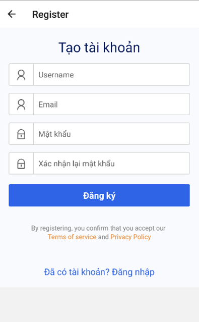
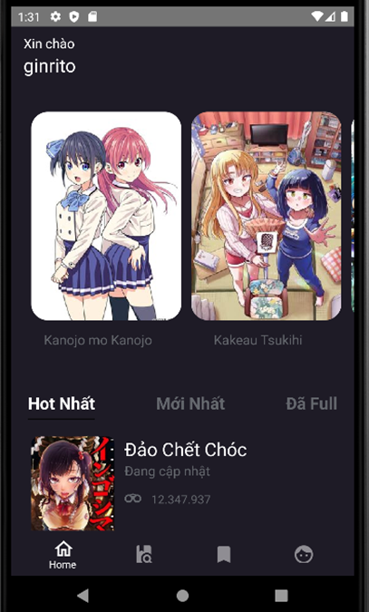
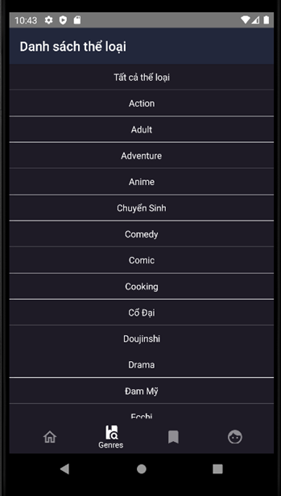
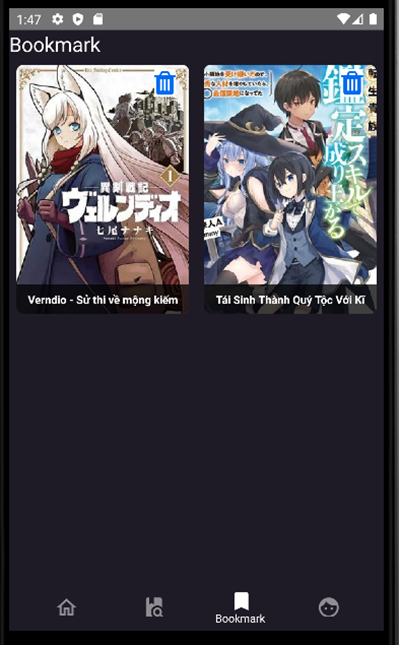

# React Native Firebase Manga App

This repository is made to read mana from [Nettruyen website](http://www.nettruyenme.com/).
Maybe the site will change domain name in future. You can change the link in folder apis to crawler it

## Packages Used
- [firebase v9]()
- [react-navigation v6](https://reactnavigation.org/docs/getting-started)
- [axios](https://github.com/axios/axios)
- [cheerio](https://github.com/cheeriojs/cheerio)
- [react-native-picker/picker](https://github.com/react-native-picker/picker)
- [react-native-viewport-units](https://github.com/jmstout/react-native-viewport-units)

### Fixed From Package @react-native-viewport-units Error
Go to this directory : <code>node_modules/react-native-viewport-units/viewport-units-js</code>
Then delete all code in that. Replace all of it by this code: 
<code>
import { Dimensions } from 'react-native';
export const vw = number => Dimensions.get('window').width * (number / 100);
export const vh = number => Dimensions.get('window').height * (number / 100);
export const vmin = number => Math.min(Dimensions.get('window').width * (number / 100), Dimensions.get('window').height * (number / 100));
export const vmax = number => Math.max(Dimensions.get('window').width * (number / 100), Dimensions.get('window').height * (number / 100));
</code>

### LogIn UI

### Register UI

### Home UI

### MangaDetail UI

### ChapterManga UI

### SearchManga UI

### FilterGenres UI

### PickerManga UI

### MangaInGenres UI

### Bookmark UI

### Comment UI

### Profile UI

### EditProfile UI

### ChangePassword UI

